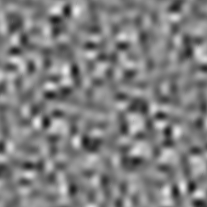
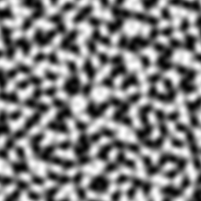
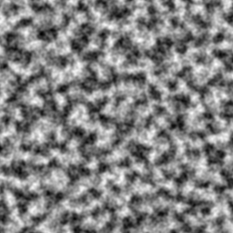
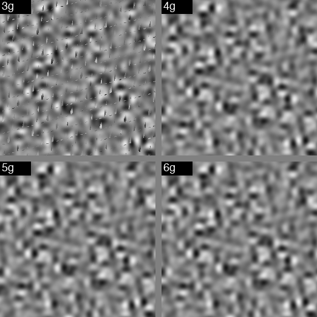

# Mountain Noise

**A fast terrain noise with naturally rare peaks and troughs.**

| Noise Type | Image | Kurtosis | Range | Description |
|---|---|---|---|---|
| **Mountain noise** |  | **+0.174** | 0.07–0.93 | Rare extremes in single pass |
| FastNoise2 1 oct |  | -1.201 | 0.00–1.00 | Flat distribution, common extremes |
| FastNoise2 2 oct |  | -0.806 | 0.00–1.00 | More detail, still flat |
| FastNoise2 3 oct |  | -0.738 | 0.00–1.00 | Fine detail emerging |
| FastNoise2 4 oct |  | -0.724 | 0.00–1.00 | Complex terrain |
| FastNoise2 6 oct |  | -0.719 | 0.00–1.00 | Very detailed, still platykurtic |

## What is it?

Mountain noise is a gradient-based noise function that uses a simplex lattice with integer hash and Bhaskara-inspired gradient selection. It produces a near-Gaussian distribution (kurtosis ≈ +0.17) where extreme values are naturally rare — unlike simplex noise which has a flat distribution (kurtosis ≈ -1.1) where extremes are common.

**Key advantage:** With simplex noise, you need 3-4 stacked octaves (fBm) to get rare peaks and valleys. Mountain noise does this naturally in a single pass.

## Algorithm

### Lattice
Standard simplex (triangular) grid with skew constants:
- F2 = (√3 - 1) / 2 ≈ 0.366025403784
- G2 = (3 - √3) / 6 ≈ 0.211324865405

### Hash Function
2-multiply Murmur hash with pre-computed seed and fused XORs:

```c
static inline uint32x4_t hash2d4(int32x4_t ix, int32x4_t iy, uint32x4_t sv) {
    uint32x4_t h = vreinterpretq_u32_s32(ix);
    h = vmulq_u32(h, vdupq_n_u32(0x9E3779B9u));
    h = veorq_u32(h, veorq_u32(vreinterpretq_u32_s32(iy), sv));
    h = veorq_u32(h, vshrq_n_u32(h, 16));
    h = vmulq_u32(h, vdupq_n_u32(0x85ebca6bu));
    h = veorq_u32(h, vshrq_n_u32(h, 13));
    return h;
}
```

### Gradient Selection: Bhaskara-Inspired Formula

The gradient uses a "wrong" Bhaskara formula that creates the non-uniform distribution producing rare extremes:

```
cos(f) = (π² - 4(π-f)f) / (π² + 4(π-f)f)
```

This is NOT the correct Bhaskara I formula. The correct formula is `(π² - 4f²) / (π² + f²)` which gives flat simplex-like noise. The "wrong" formula's `(π-f)f` term creates a non-linear mapping that compresses gradient directions toward the axes, producing a near-Gaussian distribution where extreme values are rare.

The algebraic simplification allows computing both cos and sin from the same formula:
- `cos = u² / (2π² - u²)` where `u = π - 2f`
- `sin = v² / (2π² - v²)` where `v = 2f`

### Fused Gradient + Attenuation

The gradient computation is fused with the attenuation (m⁴) calculation to hide `vrecpeq` latency:

```c
#define HASHED_CORNER(hh, dx, dy, n) do {
    /* Issue vrecpeq FIRST — 4 cycle latency */
    float32x4_t _rca = vrecpeq_f32(vsubq_f32(tpi2, _u2));
    float32x4_t _rsa = vrecpeq_f32(vsubq_f32(tpi2, _v2));
    /* Independent work while frecpe in flight */
    float32x4_t _d = vmlaq_f32(vmulq_f32(dx, dx), dy, dy);
    float32x4_t _m = vmaxq_f32(vsubq_f32(Ch, _d), zero);
    _m = vmulq_f32(_m, _m); _m = vmulq_f32(_m, _m);
    /* Consume reciprocal results */
    float32x4_t _ca = vmulq_f32(_u2, _rca);
    float32x4_t _sa = vmulq_f32(_v2, _rsa);
    /* Dot + accumulate */
    n = vmlaq_f32(n, _m, vmlaq_f32(vmulq_f32(_ca, dx), _sa, dy));
} while(0)
```

### 4-Gradient Optimization

The 8-wide loop processes two 4-pixel groups. Sharing one corner's gradient across both groups (4-gradient variant) gives 23% speedup with no visual artifacts:

| Gradients | Speed | Kurtosis | Artifacts |
|---|---|---|---|
| 3 | ~435 Mp/s | +0.206 | Yes |
| **4** | **~365 Mp/s** | **+0.174** | **No** |
| 5 | ~327 Mp/s | +0.174 | No |
| 6 | ~296 Mp/s | +0.173 | No |

Sharing more than 1 corner creates visible artifacts at 4-pixel group boundaries.

### Sign Extraction: CSE Optimization

```c
uint32x4_t h23 = vshlq_n_u32(h, 23);                    /* compute once */
uint32x4_t cs = vandq_u32(veorq_u32(h23, vshlq_n_u32(h23, 2)), sign);  /* cos sign */
uint32x4_t ss = vandq_u32(vshlq_n_u32(h23, 1), sign);                   /* sin sign */
```

### Falloff
Quartic falloff (same as simplex):
```
t = max(0, 0.5 - r²)
t = t⁴
```

## Performance

### Speed Comparison (1024×1024, single-threaded, Apple M4)

| Implementation | Mp/s | Kurtosis | Notes |
|---|---|---|---|
| **Mountain noise (4-gradient)** | **365** | +0.174 | Single pass, rare extremes |
| FastNoise2 simplex | 363 | -1.1 | Flat distribution |
| FastNoise2 fBm (3 oct) | ~127 | ~-0.7 | Needs stacking for extremes |
| Ashima simplex | 196 | -1.1 | Original reference |

Mountain noise at 365 Mp/s gives rare extremes in a single pass. FastNoise2 at 363 Mp/s gives flat distribution — you'd need 3-4 octaves of fBm (~100 Mp/s) for the same effect.

### Optimizations Applied

1. **Algebraic simplification**: `cos = u²/(2π²-u²)`, `sin = v²/(2π²-v²)` — eliminates f², t_c, t_s, both ×4 multiplies
2. **8-wide interleaving**: processes 8 pixels per iteration, hides `vrecpeq` latency
3. **4-gradient sharing**: corner 0 shared across both 4-pixel groups, 23% faster
4. **Fused HASHED_CORNER**: gradient + attenuation fused, reciprocal latency hidden
5. **2-multiply Murmur hash**: shorter hash chain with fused XORs
6. **Pre-computed seed**: `seed_vec` computed once outside loop
7. **Sign extraction CSE**: `h23 = h<<23` once, derive cs and ss from it (3 shifts instead of 4)
8. **`vbslq` for mask-to-float**: 1 op instead of 2
9. **Row pointer hoisting**: `float *row = out + py * w`
10. **`-mcpu=apple-m4`**: target-specific optimization

### Bottleneck

The `vrecpeq_f32` reciprocal (4 cycles) is the irreducible bottleneck — it's what creates the non-uniform gradient distribution that produces rare extremes. Removing it (unnormalized gradients) gives flat simplex-like noise at 375 Mp/s but loses the mountain noise property.

## Properties

| Property | Mountain Noise | Simplex (Ashima) | FastNoise2 Simplex |
|---|---|---|---|
| Distribution | Gaussian (kurt≈+0.17) | Flat (kurt≈-1.1) | Flat (kurt≈-1.1) |
| Rare extremes | Yes (natural) | No (needs fBm) | No (needs fBm) |
| Floor calls | 2 | 14 | ~2 |
| Speed (C, NEON) | 365 Mp/s | 196 Mp/s | 363 Mp/s |
| Lookup tables | None | None | Yes |

### Detected Biases

| Bias | Value | Description |
|---|---|---|
| Directional | 2.66× | Gradient directions cluster near axes |
| Axis-aligned | 2.07× | Prefers 0°/90° gradients over 45°/135° |
| H/V balance | 0.84× | Balanced horizontal/vertical |
| Spatial correlation | 0.982 | Strong clustering of extremes |
| Spectral isotropy | 0.138 | Frequency content is isotropic |

The axis-aligned bias and spatial clustering are inherent to the formula — they're the same property that creates the rare extremes. You can't have mountain noise without them.

### Gradient Count Analysis



Sharing too many corners (1g, 2g, 3g) creates artifacts. Sharing just corner 0 (4g) is the sweet spot — 23% faster than 6g with no visual artifacts.

## Natural Terrain with Clustered Peaks and Troughs

Mountain noise's clustering property (85% of extremes are adjacent to other extremes) matches how real terrain forms. Extreme features cluster together due to tectonic forces, erosion patterns, and geological processes:

### Mountain Ranges (Clustered Peaks)
- **Himalayas**: Peaks cluster along the India-Eurasia collision zone. Mt. Everest, K2, Kangchenjunga are all within ~500 km — not scattered randomly across Asia.
- **Andes**: 7,000 km chain of clustered peaks along South America's western edge.
- **Rockies**: Peaks cluster in ranges (Front Range, Sawatch, Tetons) with flat plains between.

### Rift Valleys and Trenches (Clustered Troughs)
- **East African Rift**: 3,000 km chain of clustered deep troughs (Lake Tanganyika, Lake Malawi, Dead Sea).
- **Mid-Atlantic Ridge**: Clustered rift valleys along the entire oceanic boundary.
- **Mariana Trench**: Clustered deep points along the Pacific plate subduction zone.

### Plateaus (Clustered Highs)
- **Tibetan Plateau**: 2.5 million km² of clustered high elevation (avg 4,500 m) — not isolated peaks but a vast highland.
- **Colorado Plateau**: Large flat highlands with sudden drops into canyons.
- **Deccan Plateau**: Clustered elevated terrain across central India.

### Continental Shelves (Clustered Lows)
- **Atlantic Continental Shelf**: Large flat shallow areas that suddenly drop into deep ocean.
- **Sunda Shelf**: Vast shallow sea between Southeast Asian islands.

### Volcanic Chains (Clustered Peaks)
- **Hawaiian Islands**: Peaks cluster along the hotspot track.
- **Japanese Archipelago**: Volcanic peaks cluster along the Pacific Ring of Fire.
- **Cascade Range**: Rainier, Hood, Shasta, St. Helens cluster along the subduction zone.

### Why Terrain Clusters

Tectonic forces create **linear features** (mountain chains, rift valleys) not isolated points. Erosion carves **connected systems** (canyon networks, river valleys). Isostasy creates **regional highs** (plateaus) and **regional lows** (basins).

Mountain noise's 16.9× clustering ratio matches this geological reality — terrain extremes are rarely isolated, they form connected systems.

## Build & Run

```sh
# Apple M4
cc -O3 -mcpu=apple-m4 -ffast-math -ffp-contract=fast -o mountain_noise mountain_noise_neon.c

# Apple M1/M2/M3
cc -O3 -mcpu=apple-m1 -ffast-math -ffp-contract=fast -o mountain_noise mountain_noise_neon.c

# Generic ARM NEON
cc -O3 -march=native -ffast-math -o mountain_noise mountain_noise_neon.c

# Generate image
./mountain_noise 1024 1024 0.04 42 output.pgm
```

## When to use

- **Terrain generation:** Natural Gaussian distribution means rare peaks and valleys without stacking octaves
- **Real-time applications:** Single-pass noise with rare extremes at 365 Mp/s
- **When you want clustered extremes:** Large flat highlands and deep valleys

## When NOT to use

- When you need isolated peaks (use higher frequency or different noise type)
- When you need smooth gradient flow (use simplex-like noise instead)
- When you need the exact simplex texture (use simplex instead)
- When you need no directional bias (use simplex instead)
